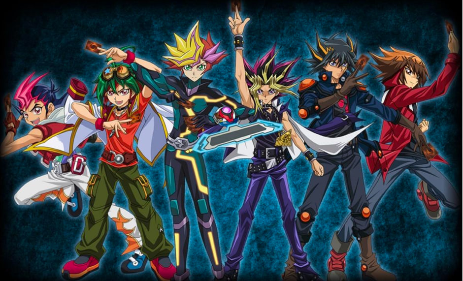

# Yu Gi Oh Tournaments



## Backend

### Technologies

- ASP.NET Core
- C#
- Entity Framework

### 1. Up Database

```bash
docker compose up -d
```

This command execute el `docker compose` file and download the last version of the `postgreSQL`.

By default the the database credentials are:

**USER**: postgres

**PASSWORD**: postgres

**DATABASE**: yu-gi-oh

### 2. Restore packages

```bash
dotnet restore
```

This command restore/install all packages installed in the project.

### 3. Execute Migrations

To run the migrations, you will need to have `Entity Framework` installed as a global tool. To see if you have `Entity Framework` installed, run:

```bash
dotnet ef --version
```

If you have an error, execute the following command to install it:

```bash
dotnet tool install --global dotnet-ef
```

After that, you can run the migrations. For this, execute the following command:

```bash
dotnet ef database update
```

### 4. Run project

```bash
# run in production mode
dotnet run

# run in development mode with watch mode
dotnet watch run --project . # inside backend folder

# create build
dotnet build
```

### 5. Fill basic data in the databse

Make a `POST` request to the endpoint:

```http
POST http://localhost:5202/api/seed
```

### 6. See Swagger Documentation

http://localhost:5202/swagger/index.html

### Frontend

> Vue App
